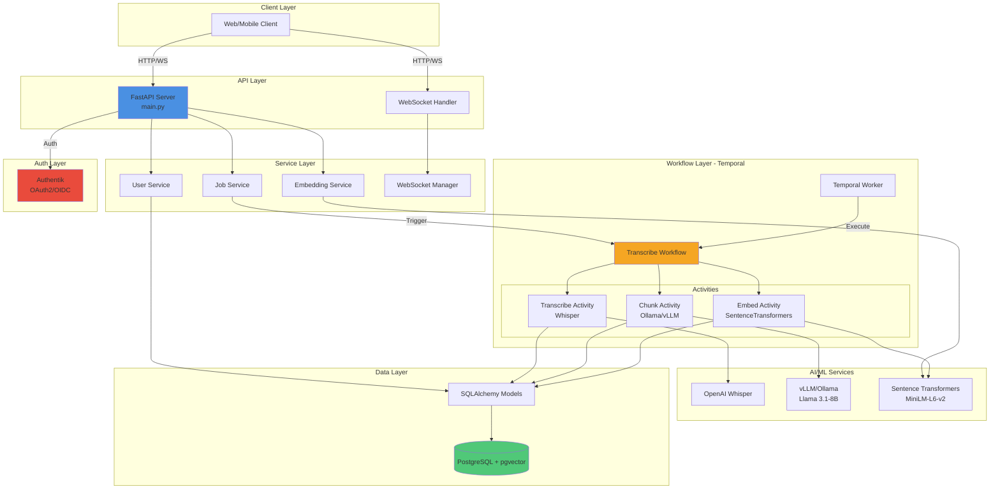
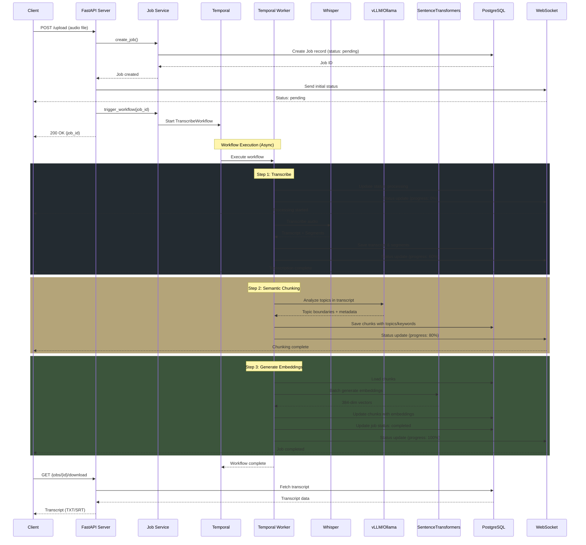
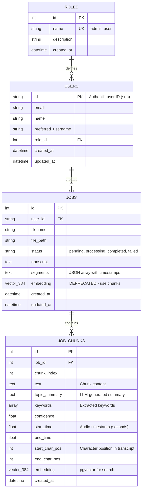

# MxWhisper

A production-ready transcription service with AI-powered semantic search capabilities. Built with FastAPI, Temporal workflows, OpenAI Whisper, and PostgreSQL with pgvector for intelligent audio-to-text conversion and semantic search.

## Table of Contents

- [Overview](#overview)
- [Architecture](#architecture)
- [System Components](#system-components)
- [Workflow Pipeline](#workflow-pipeline)
- [Data Models](#data-models)
- [Technology Stack](#technology-stack)
- [Setup](#setup)
- [API Endpoints](#api-endpoints)
- [Semantic Search](#semantic-search)
- [Development](#development)
- [Authentication](#authentication)
- [Admin Setup](#admin-setup-and-testing)

## Overview

MxWhisper is a scalable audio transcription platform that combines:

- **Audio Transcription**: OpenAI Whisper models for accurate speech-to-text conversion
- **Semantic Chunking**: LLM-powered topic analysis to create meaningful content segments
- **Vector Search**: pgvector-powered semantic search across transcripts
- **Workflow Orchestration**: Temporal for reliable, long-running background tasks
- **Real-time Updates**: WebSocket support for live progress tracking
- **Enterprise Auth**: Authentik integration with JWT and RBAC

## Architecture

MxWhisper follows a layered, service-oriented architecture with clear separation of concerns:



### System Components

The application is structured into distinct layers:

- **API Layer** ([main.py](main.py)): FastAPI endpoints and WebSocket handling
- **Services Layer** ([app/services/](app/services/)): Business logic separated by domain
  - [user_service.py](app/services/user_service.py): User management, authentication, and role handling
  - [job_service.py](app/services/job_service.py): Job management and workflow orchestration
  - [embedding_service.py](app/services/embedding_service.py): AI-powered semantic embeddings for search
  - [websocket_manager.py](app/services/websocket_manager.py): Real-time updates for job progress
- **Data Layer** ([app/data/](app/data/)): SQLAlchemy models with pgvector support
  - [models.py](app/data/models.py): Database models (User, Role, Job, JobChunk)
  - [database.py](app/data/database.py): Database session management
- **Workflow Layer** ([app/workflows/transcribe/](app/workflows/transcribe/)): Temporal workflow definitions and activities
  - [workflow.py](app/workflows/transcribe/workflow.py): Main transcription workflow orchestration
  - [activities/](app/workflows/transcribe/activities/): Individual workflow steps
- **Configuration** ([app/config.py](app/config.py), [app/logging_config.py](app/logging_config.py)): Application settings and logging

## Workflow Pipeline

The transcription workflow is orchestrated by Temporal and consists of three main stages:



### Workflow Steps Explained

1. **Transcription Activity** ([transcribe.py](app/workflows/transcribe/activities/transcribe.py))
   - Loads audio file from storage
   - Uses OpenAI Whisper to convert speech to text
   - Stores full transcript and timestamped segments
   - Returns summary (character count, segment count, language)

2. **Chunking Activity** ([chunk.py](app/workflows/transcribe/activities/chunk.py))
   - Analyzes transcript using LLM (vLLM/Ollama with Llama 3.1)
   - Identifies topic boundaries and semantic shifts
   - Creates coherent chunks with topic summaries and keywords
   - Maps chunks to timestamps from Whisper segments
   - Fallback to sentence-based chunking if LLM unavailable

3. **Embedding Activity** ([embed.py](app/workflows/transcribe/activities/embed.py))
   - Loads chunks from database
   - Generates 384-dimensional embeddings using SentenceTransformers
   - Batch processing for efficiency
   - Stores embeddings in pgvector for semantic search
   - Updates job status to "completed"

## Data Models

The application uses PostgreSQL with pgvector extension for vector storage and search:



### Database Schema Details

- **Roles**: RBAC with admin/user roles
- **Users**: Integrated with Authentik (OAuth2/OIDC)
- **Jobs**: Transcription jobs with status tracking
- **JobChunks**: Semantic chunks with embeddings for vector search
  - Uses pgvector HNSW index for fast approximate nearest neighbor search
  - Cosine similarity metric for semantic matching
  - Each chunk includes topic metadata and precise timestamps

## Technology Stack

| Category | Technology | Version | Purpose |
|----------|-----------|---------|---------|
| **Language** | Python | 3.11+ | Application runtime |
| **API Framework** | FastAPI | 0.119.0+ | REST API and WebSocket endpoints |
| **Database** | PostgreSQL | 15+ | Primary data store |
| **Vector DB** | pgvector | 0.3.6+ | Vector similarity search extension |
| **ORM** | SQLAlchemy | 2.0.44+ | Database ORM with async support |
| **DB Driver** | AsyncPG | 0.30.0+ | Async PostgreSQL driver |
| **Workflow Engine** | Temporalio | 1.18.1+ | Distributed workflow orchestration |
| **Auth** | Authentik | - | OAuth2/OIDC authentication |
| **JWT** | Python-Jose | 3.5.0+ | JWT token handling |
| **AI - Transcription** | OpenAI Whisper | 20250625 | Speech-to-text conversion |
| **AI - Chunking** | vLLM / Ollama | - | LLM inference (Llama 3.1-8B) |
| **AI - Embeddings** | SentenceTransformers | 3.3.1 | Text embedding generation |
| **Embedding Model** | all-MiniLM-L6-v2 | - | 384-dim semantic vectors |
| **Web Server** | Uvicorn | 0.37.0+ | ASGI server |
| **Migrations** | Alembic | 1.17.0+ | Database schema migrations |
| **HTTP Client** | HTTPX | 0.28.1+ | Async HTTP client |
| **Logging** | Python Logging | - | Structured logging |
| **Package Manager** | uv | - | Fast Python package manager |
| **Container Runtime** | Docker | - | Containerization |
| **GPU Support** | NVIDIA CUDA | 12.4 | GPU acceleration for AI models |

### Directory Structure

```
mxwhisper/
├── app/                          # Main application package
│   ├── auth/                     # Authentication & JWT verification
│   ├── data/                     # Database models & sessions
│   │   ├── models.py            # SQLAlchemy models
│   │   └── database.py          # DB session management
│   ├── services/                 # Business logic layer
│   │   ├── job_service.py       # Job management
│   │   ├── user_service.py      # User & auth management
│   │   ├── embedding_service.py # Vector embedding generation
│   │   └── websocket_manager.py # Real-time updates
│   ├── workflows/                # Temporal workflows
│   │   └── transcribe/
│   │       ├── workflow.py      # Main workflow orchestration
│   │       ├── worker.py        # Temporal worker process
│   │       ├── activities/      # Workflow activities
│   │       │   ├── transcribe.py # Whisper transcription
│   │       │   ├── chunk.py     # Semantic chunking
│   │       │   └── embed.py     # Embedding generation
│   │       ├── services/        # AI/ML service wrappers
│   │       │   ├── whisper_service.py
│   │       │   └── ollama_service.py
│   │       └── utils/           # Heartbeat & progress tracking
│   ├── config.py                # Application configuration
│   ├── logging_config.py        # Logging setup
│   └── cli.py                   # CLI entry point
├── main.py                       # FastAPI application
├── alembic/                      # Database migrations
│   └── versions/                # Migration scripts
├── docker/                       # Docker configuration
│   ├── Dockerfile               # Multi-stage build with CUDA
│   └── docker-compose.yml       # Service orchestration
├── tests/                        # Test suite
├── scripts/                      # Utility scripts
├── config/                       # Configuration templates
├── logs/                         # Application logs
├── uploads/                      # Temporary audio file storage
├── pyproject.toml               # Python package definition
└── README.md                    # This file
```

## Setup

1. Install dependencies:
   ```bash
   uv sync
   ```

2. Copy environment file:
   ```bash
   cp config/.env.example .env
   ```

3. Configure Whisper model (optional):

   Edit `.env` and set the desired model size:
   ```bash
   WHISPER_MODEL_SIZE=base  # Options: tiny, base, small, medium, large
   ```

   **Model size comparison:**
   - `tiny` (~40MB): Fastest, lowest accuracy - good for testing
   - `base` (~140MB): **Default** - balanced speed and accuracy
   - `small` (~480MB): Better accuracy, slower
   - `medium` (~1.5GB): High accuracy, requires more VRAM
   - `large` (~3GB): Best accuracy, slowest, highest VRAM requirement

4. Build and run with Docker:
   ```bash
   # Build with default model (base)
   ./build-image.sh

   # Build with a specific model (e.g., medium)
   docker build -f docker/Dockerfile --build-arg WHISPER_MODEL_SIZE=medium -t mxwhisper:latest .

   # Start the services
   ./deploy.sh

   # Or do both in one command
   ./deploy.sh --build
   ```

   Alternative commands:
   ```bash
   # Stop services
   ./deploy.sh --down

   # Start and show logs
   ./deploy.sh --logs

   # Show only API logs
   ./deploy.sh --logs --service api

   # Build without cache
   ./build-image.sh --no-cache
   ```

   **Note:** The Whisper model is preloaded during Docker build, so the first transcription will start immediately without downloading the model.

## API Endpoints

All endpoints except WebSocket require JWT authentication via `Authorization: Bearer <token>` header.

### User Endpoints
- `POST /upload` - Upload audio file for transcription (requires auth)
- `GET /jobs/{id}` - Get job status (requires auth)
- `GET /jobs/{id}/download` - Download completed transcript (requires auth)
- `GET /user/jobs` - Get all jobs for authenticated user (requires auth)
- `POST /search` - Semantic search across transcripts (requires auth)

### Admin Endpoints (Admin role required)
- `GET /admin/jobs` - Get all jobs across all users (admin only)
- `GET /admin/users` - Get all users and their roles (admin only)

### Real-time Updates
- `WebSocket /ws/jobs/{id}` - Real-time job status updates (no auth required)

## Semantic Search

MxWhisper includes AI-powered semantic search that allows you to find transcripts by **meaning**, not just exact keywords.

### How It Works

1. **Audio Transcription**: Whisper converts audio to text
2. **Embedding Generation**: Text is converted to 384-dimensional vectors using sentence-transformers (`all-MiniLM-L6-v2` model)
3. **Vector Storage**: Embeddings are stored in PostgreSQL with pgvector extension
4. **Similarity Search**: HNSW index enables fast approximate nearest neighbor search using cosine similarity

### Features

- **Semantic Understanding**: Search "biblical teachings" to find "scripture", "gospel", "Christ"
- **Fast & Scalable**: HNSW indexing for O(log n) search performance
- **Privacy-First**: All processing happens locally - no external API calls
- **User-Scoped**: Each user only searches their own transcripts

### API Usage

**Request:**
```bash
curl -X POST "http://localhost:8000/search" \
  -H "Authorization: Bearer YOUR_TOKEN" \
  -H "Content-Type: application/json" \
  -d '{
    "query": "biblical teachings about the Messiah",
    "limit": 10
  }'
```

**Response:**
```json
{
  "query": "biblical teachings about the Messiah",
  "results": [
    {
      "job_id": 15,
      "filename": "sermon.mp3",
      "preview": "The Bible also calls Him the Christ, the Greek word for Messiah, which means God's anointed one...",
      "similarity": 0.89,
      "created_at": "2025-10-17T10:30:00"
    }
  ]
}
```

### Search Examples

**Traditional Keyword Search** (limited):
- Query: "God's anointed" → Only finds exact matches

**Semantic Search** (intelligent):
- Query: "God's anointed" → Finds "Messiah", "Christ", "Jesus"
- Query: "love and compassion" → Finds "mercy and kindness"
- Query: "ancient scriptures" → Finds "biblical texts", "holy writings"
- Query: "spiritual leader" → Finds "pastor", "minister", "priest"

### Technical Details

- **Model**: `all-MiniLM-L6-v2` (80MB, runs on CPU, very fast)
- **Vector Dimensions**: 384 (optimal balance of speed/accuracy)
- **Distance Metric**: Cosine similarity (best for semantic search)
- **Index Type**: HNSW (Hierarchical Navigable Small World)
- **PostgreSQL Extension**: pgvector 0.8.1+

## Development

- Run migrations: `uv run alembic upgrade head`
- Start server: `uv run mxwhisper`
- Run worker: `uv run mxwhisper-worker`

### Logging

The application uses structured logging with both console and file output:
- **Log files**: Located in `logs/mxwhisper.log` (rotating, 10MB max per file, 5 backups)
- **Log levels**: INFO (default), DEBUG, WARNING, ERROR, CRITICAL
- **Format**: Text format for readability, JSON format available for production
- **External libraries**: SQLAlchemy, Temporal, and HTTPX noise is reduced

To change log level: Modify the `setup_logging()` call in `main.py`

## Database Initialization

For first-time setup:

1. **Start the services** (this creates the PostgreSQL database):
   ```bash
   docker/docker-compose up -d db
   ```

2. **Run migrations** to create tables:
   ```bash
   uv run alembic upgrade head
   ```

3. **Start the full stack**:
   ```bash
   docker/docker-compose up --build
   ```

The database schema is managed through Alembic migrations. The initial migration creates the `jobs` table with all necessary columns. Subsequent changes to the model will generate new migrations automatically.

For development without Docker, ensure PostgreSQL is running locally and update `DATABASE_URL` in your `.env` file.

## Database Setup

### Requirements

- **PostgreSQL 15+** with **pgvector extension** installed
- For semantic search to work, the pgvector extension must be available

### PostgreSQL with pgvector

**For Kubernetes Deployments:**

Use the official pgvector PostgreSQL image in your deployment:
```yaml
postgresql_image: "pgvector/pgvector:pg15"
```

Then enable the extension on your database:
```bash
# Enable pgvector extension (requires superuser privileges)
kubectl exec -n databases postgresql-primary-0 -- \
  psql -U postgres -d mxwhisper -c "CREATE EXTENSION IF NOT EXISTS vector;"

# Verify installation
kubectl exec -n databases postgresql-primary-0 -- \
  psql -U postgres -d mxwhisper -c "\dx vector"
```

**For Docker/Local Development:**

If using standard PostgreSQL, install pgvector:
```bash
# Ubuntu/Debian
sudo apt install postgresql-15-pgvector

# Then in psql:
CREATE EXTENSION IF NOT EXISTS vector;
```

Or use the Docker image:
```yaml
# docker-compose.yml
services:
  db:
    image: pgvector/pgvector:pg15
```

### Running Migrations

1. **Ensure PostgreSQL database exists** with the credentials in your `.env` file
2. **Ensure pgvector extension is enabled** (see above)
3. **Run migrations** to create tables and vector columns:
   ```bash
   uv run alembic -c config/alembic.ini upgrade head
   ```

This will create:
- Database tables (jobs, users, roles)
- Vector column for embeddings (384 dimensions)
- HNSW index for fast similarity search

## Authentication

The API uses JWT tokens issued by Authentik for authentication. Tokens must be included in the `Authorization` header as `Bearer <token>`.

### Configuration

Set the following environment variables in your `.env` file:

- `AUTHENTIK_SERVER_URL`: Base URL of your Authentik instance
- `AUTHENTIK_CLIENT_ID`: OAuth2 client ID
- `AUTHENTIK_CLIENT_SECRET`: OAuth2 client secret
- `AUTHENTIK_ISSUER_URL`: Token issuer URL
- `AUTHENTIK_JWKS_URL`: JWKS endpoint for public key verification
- `AUTHENTIK_EXPECTED_ISSUER`: Expected issuer claim in tokens
- `AUTHENTIK_EXPECTED_AUDIENCE`: Expected audience claim in tokens
- `AUTHENTIK_SCOPES`: OAuth scopes (default: "openid profile email")

The application automatically fetches and caches Authentik's public keys for token verification.

### Roles and Permissions

The application supports role-based access control:

- **User**: Can upload files and view their own jobs
- **Admin**: Can view all jobs and users across the system

Admin roles are determined by Authentik groups. Users with groups containing "admin", "administrators", or "Admins" are automatically assigned admin role.

Default roles are created automatically on application startup.

## Admin Setup and Testing

### Manual Authentik Group Configuration

**You need to do this manually in the Authentik web UI:**

1. **Log into Authentik Admin**: `http://authentik.mixwarecs-home.net/if/admin/`
2. **Create Admin Group**:
   - Directory → Groups → Create
   - Name: `admin.mxwhisper` (recommended for consistency)
   - Add users who should have admin access
3. **Add Admin Users**:
   - Directory → Users → Select user → Groups tab → Add to admin group
4. **Test JWT Token**:
   - Login with admin user
   - JWT should contain: `"groups": ["admin", ...]`

### Setting Up a Specific Admin User

For better organization, create a dedicated admin user in Authentik:

1. **Create User in Authentik**:
   - Directory → Users → Create
   - Username: `admin.mxwhisper` (or your preferred naming)
   - Email: `admin@yourdomain.com`
   - Set a strong password

2. **Add to Admin Group**:
   - Select the user → Groups tab
   - Add to the `admin` group you created earlier

3. **Test Admin Access**:
   - Login as `admin.mxwhisper`
   - JWT token will include `"groups": ["admin", ...]`
   - Access admin endpoints: `/admin/users`, `/admin/jobs`

### Why Not Create Default Admin Users?

**Security Best Practice**: The application does NOT create default admin users because:

- ❌ **Security Risk**: Predefined admin accounts are common attack targets
- ❌ **No Password Management**: Authentik handles passwords, not the app
- ✅ **Group-Based Access**: Admin access via Authentik groups is more secure
- ✅ **Flexible**: Multiple users can be admins by adding them to the group

### Testing Admin Functionality

Run the test script to verify role assignment:

```bash
uv run python tests/test_admin_setup.py
```

This will:
- ✅ Test role initialization
- ✅ Test user creation with different group memberships  
- ✅ Show mock JWT tokens for testing
- ✅ Provide detailed Authentik setup instructions

### Manual API Testing

After setting up Authentik groups:

```bash
# Start the server
uv run mxwhisper --reload --port 3001

# Test admin endpoints with real JWT tokens from Authentik
curl -H "Authorization: Bearer <admin-jwt-token>" http://localhost:3001/admin/jobs
curl -H "Authorization: Bearer <admin-jwt-token>" http://localhost:3001/admin/users

# Test regular user access (should fail)
curl -H "Authorization: Bearer <regular-jwt-token>" http://localhost:3001/admin/users
```

7. Alternative Group Names:
   The app recognizes these group names as admin:
   - "admin.mxwhisper" (recommended)
   - "mxwhisper-admin"
   - "admin"
   - "administrators"
   - "Admins"